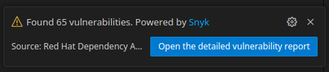
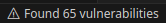
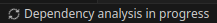
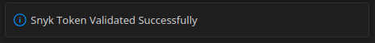

# Red Hat Dependency Analytics

[](https://marketplace.visualstudio.com/items?itemName=redhat.fabric8-analytics)

[](https://codecov.io/gh/fabric8-analytics/fabric8-analytics-vscode-extension)

`Red Hat Dependency Analytics (RHDA)` is powered by [Snyk Intel Vulnerability DB](https://snyk.io/product/vulnerability-database/). It is the most advanced and accurate open source vulnerability database in the industry and adds value with the latest, fastest, and numerous vulnerabilities derived from multiple sources.

`Red Hat Dependency Analytics Report` provides insights about your application dependencies and flags security vulnerabilities(CVE).

## Supported Languages

RHDA extension supports projects using Maven and NPM (Node) ecosystems.
Extending support for other languages is currently in progress.

## Prerequisites

This extension assumes you have the following binaries on your *PATH*:

- `mvn` (for analyzing Java applications)
- `npm` (for analyzing Node applications)

**Note:** By default, the `mvn/npm` command is executed directly in the terminal, which requires that `mvn/npm` is found in your system environment `PATH`.
In case it is located elsewhere you can configure this via preferences in VS Code. To do this access the [extension settings](https://code.visualstudio.com/docs/getstarted/settings) within your VS code instance, switch to *Workspace* tab, search for *\<Ecosystem\> Executable Path* and edit the *Path* setting.
You can also the `settings.json` file and add the following:

```
{
    ...
    "maven.executable.path": "/path-to-maven-home/bin/mvn"
    "npm.executable.path": "/path-to-npm-home/bin/npm"
    ...
}
```

## Quick Start

Install the `Red Hat Dependency Analytics` extension from *Extensions Marketplace*.

Configure the Snyk Token in the *extension workspace settings*. Please find configuration instructions [here](#configuration).
On successfully entering the Snyk token, the Red Hat Dependency Analytics report can provide detailed information about security vulnerabilities unique to Snyk and vulnerabilities having publicly known exploits.
<br >**IMPORTANT** Please note that if a valid Snyk Token is not provided in the extension workspace settings, Snyk vulnerabilities will not be displayed.

Open or edit a manifest file *(pom.xml/package.json)* to trigger inline `Component Analysis`. This feature scans your application and provides inline feedback on any dependencies identified with security vulnerabilities.

Generate a `Red Hat Dependency Analytics Report` for your application by performing any of the following actions:
- Right click on a manifest file in the *Vscode File explorer* or *Vscode File editor* and choose the `Red Hat Dependency Analytics Report` option.
- On an open manifest file, click on the *pie icon*  located at the upper right corner in the tab container.
- On an open manifest file, hoover over a dependency marked by the inline `Component Analysis`, click on *Quick Fix* and choose *Detailed Vulnerability Report* option`.
- Click on `Open detailed vulnerability report` button inside the vulnerability alert popup message.
- Click on `Found <NUMBER> vulnerabilities` in the *status bar* bellow.
- Click on `Dependency analysis in progress` in the *status bar* bellow (only visible when Component Analysis is in progress and not yet complete).
<br > Check out the [features](#features) section for more deatils.

> **NOTE** `Red Hat Dependency Analytics` is an online service hosted and maintained by Red Hat. This open source software will access only your manifests file(s) to analyse the application dependencies within before providing you with a detailed report.

## Features

1. **Component Analysis**
	<br >Upon opening or editing a manifest file *(pom.xml/package.json)*, an automated scan will be triggered on your application. This process provides immediate, inline feedback regarding any dependencies that have been detected to have security vulnerabilities. Such dependencies will be appropriately flagged in red and present a short summary when hoovered over. Summary contains the full package name and version, amount of known security vulnerabilities and highest severity status of said vulnerabilities.
	<br >**Note** a *target* folder will be created in the workspace, used to process pom.xml files. Please add *target* to *.gitignore*.

	

1. **Excluding dependencies with exhortignore**
	<br >Excluding a package from analysis can be achieved by marking the package for exclusion. 
	If users wish to ignore vulnerabilities for a dependency in a **pom.xml** file for *Java Maven* ecosystem, it can be done by adding `exhortignore` as a comment against the dependency, group id, artifact id, or version scopes of that particular dependency in the manifest file. example:
	```
	<dependency> <!--exhortignore-->
		<groupId>...</groupId>
		<artifactId>...</artifactId>
		<version>...</version>
	</dependency>
	```
	**package.json** Node manifest files for *Javascript NPM* ecosystem don't support comments, hence `exhortignore` must be given inside a JSON. If `exhortignore` is followed by a list of comma-separated Snyk vulnerability IDs, only the listed vulnerabilities will be ignored during analysis. example:
	```
	{
		"name": "sample",
		"version": "1.0.0",
		"description": "",
		"main": "index.js",
		"keywords": [],
		"author": "",
		"license": "ISC",
		"dependencies": {
			"dotenv": "^8.2.0",
			"express": "^4.17.1",
			"jsonwebtoken": "^8.5.1",
			"mongoose": "^5.9.18"
		},
		"exhortignore": [
			"jsonwebtoken"
		]
	}
	```

1. **Excluding dev/test dependencies**
	<br >`Red Hat Dependency Analytics` does not analyse dependencies marked as **dev/test**. These dependencies will be ignored. example:
	
	*test* scope in *pom.xml*:
	```
	<dependency>
		<groupId>...</groupId>
		<artifactId>...</artifactId>
		<version>...</version>
		<scope>test</scope>
	</dependency>
	```	
	*devDependencies* field in *package.json*:
	```
	{
		"name": "sample",
		"version": "1.0.0",
		"description": "",
		"main": "index.js",
		"keywords": [],
		"author": "",
		"license": "ISC",
		"dependencies": {
			"dotenv": "^8.2.0",
			"express": "^4.17.1",
			"jsonwebtoken": "^8.5.1",
			"mongoose": "^5.9.18"
		},
		"devDependencies": {
			"axios": "^0.19.0"
		}
	}
	```

1. **Red Hat Dependency Analytics Report** 
	<br >To generate the `Red Hat Dependency Analytics Report` for your application, you can do one of the following:
	- Right click on a manifest file *(pom.xml/package.json)* in the *Vscode File explorer* or *Vscode File editor* and choose the `Red Hat Dependency Analytics Report` option.
	- On an open manifest file, click on the *pie icon*  located at the upper right corner in the tab container.
	- On an open manifest file, hoover over a dependency marked by the inline `Component Analysis`, click on *Quick Fix* and choose *Detailed Vulnerability Report* option.
	
	- Click on `Open detailed vulnerability report` button inside the vulnerability alert popup message.<br >
	
	- Click on `Found <NUMBER> vulnerabilities` in the *status bar* bellow.<br >
	
	- Click on `Dependency analysis in progress` in the *status bar* bellow (only visible when Component Analysis is in progress and not yet complete).<br >
	

	**Bonus Feature** The HTML of the `Red Hat Dependency Analytics Report` will be stored temporarily while the `Red Hat Dependency Analytics Report` tab remains open. Once the tab is closed, the corresponding file will be automatically removed. You can define the filename by [adjusting the configuration](#configuration) in the *extensions workspace settings*, under the *Red Hat Dependency Analytics: Red Hat Dependency Analytics Report File Path* field. The default location for this file is `/tmp/redhatDependencyAnalyticsReport.html`.

## Configuration

The `Red Hat Dependency Analytics` plugin has configurable parameters within the extension that allow users to tailor the behavior and functionality of the extension according to their preferences.
To access these configurable parameters please enter the [extension settings](https://code.visualstudio.com/docs/getstarted/settings) within your VS code instance, switch to *Workspace* tab and search for *Red Hat Dependency Analytics*.


### Configurable Parameters

**Exhort Snyk Token** - edit the *Exhort Snyk Token* setting to change the Snyk token setting.
The Snyk Token allows Exhort to authenticate with Snyk (vulnerability data provider).
Please note that if a valid Snyk Token is not provided in the extension workspace settings, Snyk vulnerabilities will not be displayed.
An alert message on edit will provide feedback on whether the token is valid or not.
To generate a new token please visit the following [link](https://app.snyk.io/login?utm_campaign=Code-Ready-Analytics-2020&utm_source=code_ready&code_ready=FF1B53D9-57BE-4613-96D7-1D06066C38C9).

**Valid Token Info Message**<br >


**Invalid Token Alert Message**<br >


**Enpty Token Warning Message**<br >


**Red Hat Dependency Analytics Report File Path** - edit the *Red Hat Dependency Analytics Report File Path* setting to change the location where the HTML of the `Red Hat Dependency Analytics Report` will be stored (Default value: `/tmp/redhatDependencyAnalyticsReport.html`).

## Using Red Hat Dependency Analytics on your CI Builds

To automate the analysis of vulnerabilities in a project's dependencies, we offer integration with the following Continuous Integration (CI) platforms:

- [Red hat Dependency Analytics Tekton Task](https://hub.tekton.dev/tekton/task/redhat-dependency-analytics)

- [Red hat Dependency Analytics Jenkins Plugin](https://plugins.jenkins.io/redhat-dependency-analytics/)

- Red hat Dependency Analytics GitHub Actions \<TBD\>

## Know more about Red Hat Dependency Analytics Platform

The mission of this project is to enhance developer experience significantly:
providing Insights for applications and helping developers and enterprises.

- [GitHub Organization](https://github.com/fabric8-analytics)

## Support, Feedback & Questions

- For assistance, reach out to us at `rhda-support@redhat.com`

- File a bug in [GitHub Issues](https://github.com/fabric8-analytics/fabric8-analytics-vscode-extension/issues)

## License

Apache 2.0, See [LICENSE](LICENSE) for more information.

## Data and telemetry

The Red Hat Dependency Analytics Extension for Visual Studio Code collects anonymous [usage data](Telemetry.md) and sends it to Red Hat servers to help improve our products and services. Read our [privacy statement](https://developers.redhat.com/article/tool-data-collection) to learn more. This extension respects the `redhat.telemetry.enabled` setting which you can learn more about at https://github.com/redhat-developer/vscode-commons#how-to-disable-telemetry-reporting
