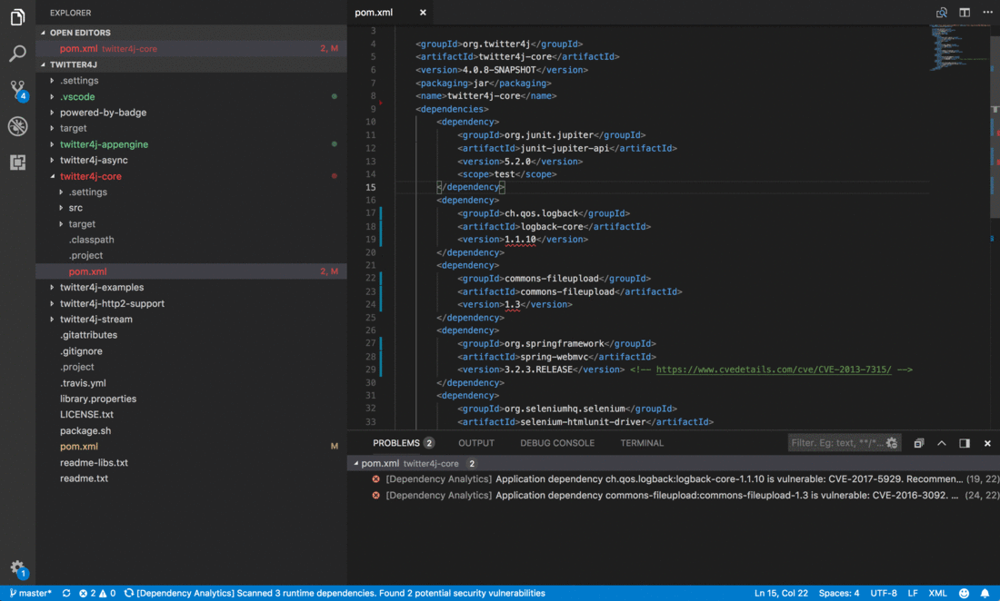
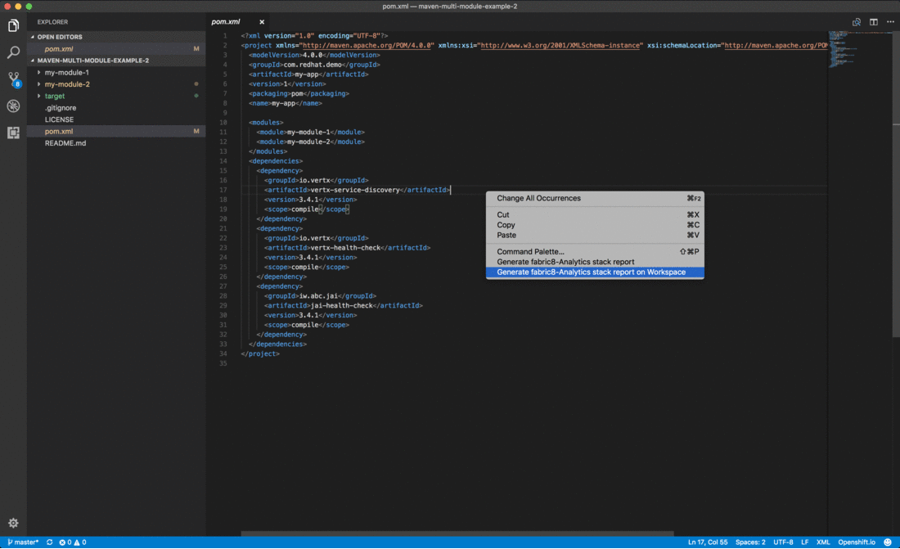
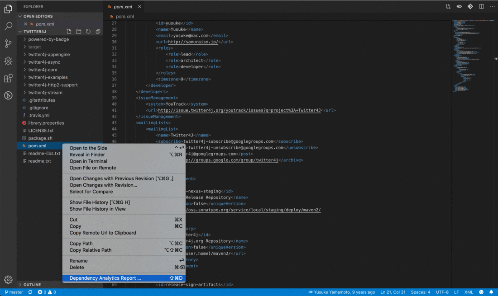

# Dependency Analytics

[](https://marketplace.visualstudio.com/items?itemName=redhat.fabric8-analytics)

'Dependency Analytics Report' with Insights about your application dependencies:

- Flags a security vulnerability(CVE) and suggests a remedial version
- Shows Github popularity metrics along with latest version
- Suggests a project level license, check for conflicts between dependency licences
- AI based guidance for additional, alternative dependencies

## Supported Languages

'Dependency Analytics' extension supports projects using Maven, projects build on npm (Node ecosystem) and projects using Python.
Extending support for Golang and other languages is currently under progress.

## Prerequisites

This extension assumes you have the following binaries on your `PATH`:

- `mvn` (for analyzing Java applications)
- `npm` (for analyzing Node applications)
- `python` (for analyzing Python applications)

**Note:** By default, the `mvn/npm` command is executed directly in the terminal, which requires that `mvn/npm` is found in your system environment `PATH`. For Python applications [Interpreter Path](https://code.visualstudio.com/docs/python/environments#_manually-specify-an-interpreter) is required to be provided as below.
You can do this via preferences in VS Code:
File(Code on macOS) > Preferences > Settings to open your [Settings](https://code.visualstudio.com/docs/getstarted/settings) select Workspace (open settings.json) and add below.

```
{
    ...
    "maven.executable.path": "/path-to-maven-home/bin/mvn"
    "npm.executable.path": "/path-to-npm-home/bin/npm"
    "python.pythonPath": "/path-to-python-home/bin/python"
    ...
}
```

> **NOTE** Dependency Analytics is an online service hosted and maintained by Red Hat. This open source software will access only your manifests and license file(s) to learn about application dependencies and licenses before giving you the report.

## Quick Start

- Install the extension.
- Opening or editing a manifest file (`pom.xml` / `package.json` / `requirements.txt`) scans your application for security vulnerabilities.
- Right click on a manifest file (`pom.xml`/`package.json` / `requirements.txt`) in the 'Vscode File explorer' or 'Vscode File editor' to display 'Dependency Analytics Report' for your application.

## Features

1. Opening or editing a manifest file (`pom.xml` / `package.json` / `requirements.txt`) scans your application for security vulnerabilities, flag them along with 'quick fixes'.



2. Right click on a manifest file(`pom.xml` / `package.json` / `requirements.txt`) and choose 'Dependency Analytics Report ...' to display 'Dependency Analytics' report. This report covers deeper insights into your application dependencies:

- Flags a security vulnerability(CVE) and suggests a remedial version
- Shows Github popularity metrics along with latest version
- Suggests a project level license, check for conflicts between dependency licences
- AI based guidance for additional,alternative dependencies



3. **For multi module maven application** Right click on root `pom.xml` in editor window and choose 'Dependency Analytics Report ...' to display 'Dependency Analytics' report for the entire application.



---

**Note** It creates a folder `target` in workspace which is used for processing of manifest files, needed for generating stack report. So kindly add `target` in `.gitignore`.

# Know more about Dependency Analytics Platform

The mission of this project is to significantly enhance developer experience:
providing Insights(security, licenses, AI based guidance) for applications and helping developers, Enterprises.

- [GitHub Organization](https://github.com/fabric8-analytics)

# Feedback & Questions

- File a bug in [GitHub Issues](https://github.com/fabric8-analytics/fabric8-analytics-vscode-extension/issues)

# License

Apache 2.0, See [LICENSE](LICENSE) for more information.
