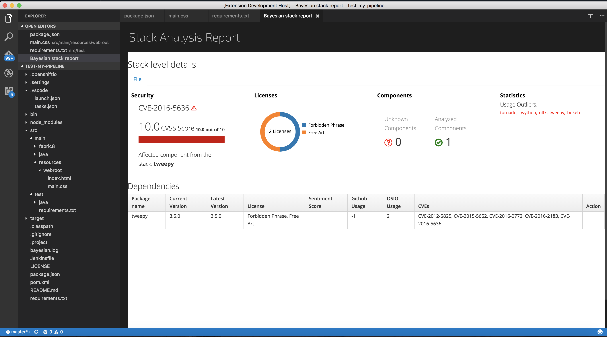

# fabric8-analytics stack report
This is an sample extension that illustrates the use of virtual documents or `TextDocumentContentProviders` together with the `vscode.previewHtml`
[command](https://code.visualstudio.com/docs/extensionAPI/vscode-api-commands#_commands).

The purpose of the extension is to show stack analysis report. To play with the extension:
- Open a manifest file i.e (`requirements.txt`, `pom.xml`, `package.json`)
- Use `Show stack report`

# How it works

- The extension implements and registers a [`TextDocumentContentProvider`](http://code.visualstudio.com/docs/extensionAPI/vscode-api#TextDocumentContentProvider) for a particular URI scheme.
- The generated HTML document is then opened in an editor using the command `vscode.previewHtml`.

# How to run locally

* `npm install`
* `npm run compile` to start the compiler in watch mode
* open this folder in VS Code and press `F5`
