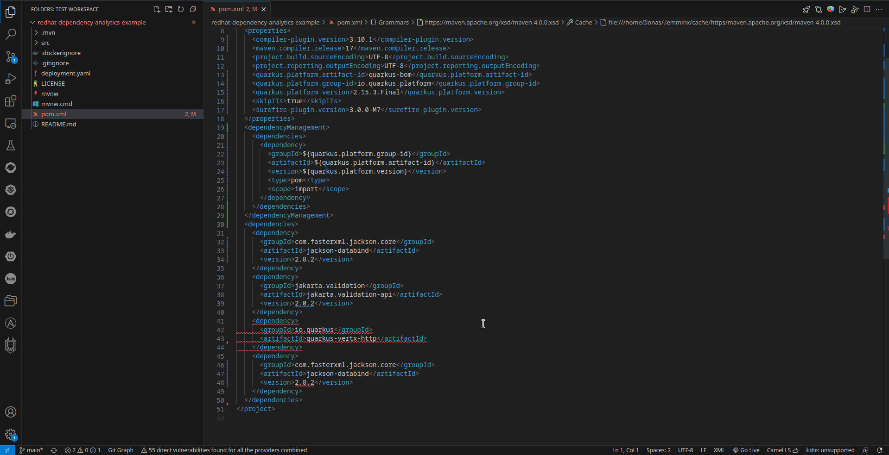

# Red Hat Dependency Analytics

[](https://marketplace.visualstudio.com/items?itemName=redhat.fabric8-analytics)

[](https://codecov.io/gh/fabric8-analytics/fabric8-analytics-vscode-extension)

Red Hat's Dependency Analytics (RHDA) extension gives you awareness to security concerns within your software supply chain while you code your application.
The Red Hat Dependency Analytics extension uses vulnerability data sources for the most up-to-date vulnerability information available.

**NOTE:**
<br >The Red Hat Dependency Analytics extension is an online service hosted and maintained by Red Hat.
Red Hat Dependency Analytics only accesses your manifest files to analyze your application dependencies before displaying the vulnerability report.

**IMPORTANT:**
<br >Currently, Red Hat Dependency Analytics only supports projects that use Maven (`mvn`), Node (`npm`), Golang (`go mod`), Python (`pip`), and Gradle (`gradle`) ecosystems.
In future releases, Red Hat plans to support other programming languages.

##### Table of Contents
- [Red Hat Dependency Analytics](#red-hat-dependency-analytics)
				- [Table of Contents](#table-of-contents)
	- [Quick start](#quick-start)
	- [Configuration](#configuration)
		- [Configurable parameters](#configurable-parameters)
	- [Features](#features)
	- [Using Red Hat Dependency Analytics for CI builds](#using-red-hat-dependency-analytics-for-ci-builds)
	- [Data and telemetry](#data-and-telemetry)
	- [Known issues](#known-issues)
		- [Error when using options the `Use Pip Dep Tree` and `Use Python Virtual Environment` simultaneously](#error-when-using-options-the-use-pip-dep-tree-and-use-python-virtual-environment-simultaneously)
		- [Red Hat Dependency Analytics limitations for Maven and Gradle](#red-hat-dependency-analytics-limitations-for-maven-and-gradle)
	- [Support, feedback \& questions](#support-feedback--questions)
	- [Learn more about the Red Hat Dependency Analytics platform](#learn-more-about-the-red-hat-dependency-analytics-platform)
	- [License](#license)

## Quick start

**Prerequisites**

- For Maven projects, analyzing a `pom.xml` file, you must have the `mvn` binary in your system’s `PATH` environment.
- For Node projects, analyzing a `package.json` file, you must have the `npm` binary in your system’s `PATH` environment.
- For Golang projects, analyzing a `go.mod` file, you must have the `go` binary in your system’s `PATH` environment.
- For Python projects, analyzing a `requirements.txt` file, you must have the `python3/pip3` or `python/pip` binaries in your system’s `PATH` environment.
- For Gradle projects, analyzing a `build.gradle` file, you must have the `gradle` binary in your system's `PATH` environment.
- For base images in a `Dockerfile` or `Containerfile`, you must have `Java version 20` or later.

<br >**IMPORTANT:** 
<br >Visual Studio Code by default executes binaries directly in a terminal found in your system's `PATH` environment.
You can configure Visual Studio Code to look somewhere else to run the necessary binaries.
You can configure this by accessing the [extension settings](https://code.visualstudio.com/docs/getstarted/settings).
Click the **Workspace** tab, search for the word _executable_, and specify the absolute path to the binary file you want to use for Maven, Node or Golang.

**Procedure**

1. Install [Visual Studio Code](https://code.visualstudio.com/) on your workstation.
2. After the installation finishes, open the Visual Studio Code application.
3. From the file menu, click **View**, and click **Extensions**.
4. Search the **Marketplace** for _Red Hat Dependency Analytics_.
5. Click the **Install** button to install the extension.
6. To start scanning your application for security vulnerabilities, and view the vulnerability report, you can do one of the following:
   - Open a manifest file, hover over a dependency marked by the inline Component Analysis, indicated by the wavy-red line under a version number or dependency name, click **Quick Fix**, and click **Detailed Vulnerability Report**.
   - Open a manifest file, and click the **pie chart** icon .
   - Right click on a manifest file in the **Explorer** view, and click **Red Hat Dependency Analytics Report...**.
   - From the vulnerability pop-up alert message, click **Open detailed vulnerability report**.

## Configuration

The Red Hat Dependency Analytics extension has some configurable parameters that allows you to customize its behavior according to your preferences.

**Procedure**

1. Open the Visual Studio Code application.
2. From the file menu, click **View**, and click **Extensions**.
3. Find the installed **Red Hat Dependency Analytics** extension, and click the **Gear** icon.
4. Click **Extension Settings**.

   

### Configurable parameters

**Red Hat Dependency Analytics Report File Path** :
<br >Specify the local path to create the Red Hat Dependency Analytics report file.
The default path is `/tmp/redhatDependencyAnalyticsReport.html`.

<br >**IMPORTANT:** 
<br >The `redHatDependencyAnalyticsReportFilePath` setting name has changed to `reportFilePath`.

**Inline Vulnerability Severity Alerts** :
<br >You can set the vulnerability severity alert level to `Error` or `Warning` for inline notifications of detected vulnerabilities.

**Python** : 
* `usePythonVirtualEnvironment` : Automates the installation of missing packages in a Python virtual environment.
* `enablePythonBestEffortsInstallation` : Installs Python packages for the Python version is use, disregarding declared versions.
  This configuration option requires the _Match Manifest Versions_ option set to `false`, and _Use Python Virtual Environment_ option set to `true`.
* `usePipDepTree` : Use the `pipdeptree` command-line tool for building the Python dependency tree.
  This can enhance analysis time.

**Golang** :
* `useGoMVS` : Use the minimal version selection algorithm to select a set of module versions to use when building Go packages.

## Features

- **Component analysis**
	<br >Upon opening a manifest file, such as a `pom.xml`, `package.json`, `go.mod` or `requirements.txt` file, a vulnerability scan starts the analysis process.
	The scan provides immediate inline feedback on detected security vulnerabilities for your application's, and container's dependencies.
	Such dependencies are appropriately underlined in red, and hovering over it gives you a short summary of the security concern from the available data sources.
	The summary has the full package name, version number, the amount of known security vulnerabilities, and the highest severity status of said vulnerabilities.
	
	**NOTE:** Add the `target` folder to your `.gitignore` file to exclude it from Git monitoring.

	

- **Recommendations and remediation** 
    <br >After running a detailed analysis report on a specific component version, you can view recommendations and remediation by using the _Quick Fix..._ menu.
	If there is a Red Hat recommended package version available, you can replace your version with Red Hat's version.

	

	<br >**IMPORTANT:** For Maven projects only, when analyzing a `pom.xml` file.
	You must configure Red Hat's generally available (GA) repository to use the recommendations or remediation.
	Add this repository, `https://maven.repository.redhat.com/ga/`, to your project's configuration.

- **Docker scanning**
    <br >Upon opening a Dockerfile, a vulnerability scan starts analyzing the images within the Dockerfile.
    After the analysis finishes, you can view any recommendations and remediation by clicking the _Quick Fix..._ menu from the highlighted image name.
	Any recommendations for an alternative image does not replace the current image.
	By clicking _Switch to..._, you go to Red Hat's Ecosystem Catalog for the recommended image.

	<br >You must have the [`syft`](https://github.com/anchore/syft#installation) and [`skopeo`](https://www.redhat.com/en/topics/containers/what-is-skopeo) binaries installed on your workstation to use the Docker scanning feature.
	You can specify a specific path to these binaries, and others by settings the following parameters:

	* `syft.executable.path` : Specify the absolute path of `syft` executable.
    * `syft.config.path` : Specify the absolute path to the Syft configuration file.
    * `skopeo.executable.path` : Specify the absolute path of `skopeo` executable.
    * `skopeo.config.path` : Specify the absolute path to the authentication file used by the `skopeo inspect` command.
    * `docker.executable.path` : Specify the absolute path of `docker` executable.
    * `podman.executable.path` : Specify the absolute path of `podman` executable.
    * `image.platform` : Specify the platform used for multi-arch images.
  
- **Excluding dependencies with `exhortignore`**
	<br >You can exclude a package from analysis by marking the package for exclusion.
	How you exclude a package varies based on the your project's language:

	- **Maven**
	<br >If you want to ignore vulnerabilities for a dependency in a `pom.xml` file, you must add `<!--exhortignore-->` to the end of the line as a comment against the dependency, group id, artifact id, or version scopes of that particular dependency in the manifest file.
	For example:
    
	     ```xml
	     <dependency> <!--exhortignore-->
		     <groupId>...</groupId>
		     <artifactId>...</artifactId>
		     <version>...</version>
	     </dependency>
	    ```

	- **Node**
	<br >If you wish to ignore vulnerabilities for a dependency in a `package.json` file, you must add `exhortignore` as a attribute-value pair.
	The value for `exhortignore` is a list of comma-separated vulnerability IDs.
	This list of vulnerabilities are ignored during analysis.
	For example:

	     ```json
	     {
		     "name": "sample",
		     "version": "1.0.0",
		     "description": "",
		     "main": "index.js",
		     "keywords": [],
		     "author": "",
		     "license": "ISC",
		     "dependencies": {
			     "dotenv": "^8.2.0",
			     "express": "^4.17.1",
			     "jsonwebtoken": "^8.5.1",
			     "mongoose": "^5.9.18"
		     },
		     "exhortignore": [
			     "jsonwebtoken"
		     ]
	     }
	     ```

	- **Go**
	<br >If you want to ignore vulnerabilities for a dependency in a `go.mod` file, you must add `// exhortignore` to the end of the line as a comment against the dependency in the manifest file.
	For example:

	     ```go
	     require (
		     golang.org/x/sys v1.6.7 // exhortignore
	     )
	     ```

	- **Python**
	<br >If you want to ignore vulnerabilities for a dependency in a `requirements.txt` file, you must add `# exhortignore` to the end of the line as a comment against the dependency in the manifest file.
	For example:

	     ```python
	     requests==2.28.1 # exhortignore
	     ```

	- **Gradle**
    <br >If you want to ignore vulnerabilities for a dependency in a `build.gradle` file, you must add `// exhortignore` to the end of the line as a comment against the dependency in the manifest file.
	For example:

	     ```gradle
	     plugins {
	     id 'java'
	     }

	     group = 'groupName'
	     version = 'version'
     
	     repositories {
		     mavenCentral()
	     }
     
	     dependencies {
		     implementation "groupId:artifactId:version" // exhortignore
	     }
     
	     test {
		     useJUnitPlatform()
	     }
	     ```

- **Excluding developmental or test dependencies**
	<br >Red Hat Dependency Analytics does not analyze dependencies marked as `dev` or `test`, these dependencies are ignored.
	
	For example, setting `test` in the `scope` tag within a `pom.xml` file:

	```xml
	<dependency>
		<groupId>...</groupId>
		<artifactId>...</artifactId>
		<version>...</version>
		<scope>test</scope>
	</dependency>
	```	

	For example, setting `devDependencies` attributte in the `package.json` file:
	
	```json
	{
		"name": "sample",
		"version": "1.0.0",
		"description": "",
		"main": "index.js",
		"keywords": [],
		"author": "",
		"license": "ISC",
		"dependencies": {
			"dotenv": "^8.2.0",
			"express": "^4.17.1",
			"jsonwebtoken": "^8.5.1",
			"mongoose": "^5.9.18"
		},
		"devDependencies": {
			"axios": "^0.19.0"
		}
	}
	```

	For example, setting the `exclude` attribute in the `go.mod` file:

	```go
	exclude golang.org/x/sys v1.6.7

	exclude (
		golang.org/x/sys v1.6.7
	)
	```

	For example, setting a dependency as test in the `build.gradle` file by placing it under one of the test configurations: `testImplementation`, `testCompileOnly`, `testRuntimeOnly`

	```gradle
	dependencies {
		implementation group: 'org.springframework.boot', name: 'spring-boot-starter-web', version: '2.7.4'
    	testImplementation group: 'org.springframework.boot', name: 'spring-boot-starter-test', version: '2.7.4'
		testCompileOnly 'junit:junit:4.13.1'
		testRuntimeOnly 'org.mockito:mockito-core:3.3.3'
	}
	```

	For example, creating an alternative file to `requirements.txt`, like `requirements-dev.txt` or `requirements-test.txt` and adding the dev or test dependencies there instead.
	
- **Red Hat Dependency Analytics report** 
	<br >The Red Hat Dependency Analytics report is a temporary HTML file that exist if the **Red Hat Dependency Analytics Report** tab remains open.
	Closing the tab removes the temporary HTML file.
	You can specify the file name by [modifying the _Red Hat Dependency Analytics: Red Hat Dependency Analytics Report File Path_ field](#configuration) in the extension settings.

- **Python and Go package manager behavior**
    <br >When a user requests a Python or a Go package analysis, Red Hat Dependency Analytics performs the analysis by looking at the version tags from those environments, and not from the manifest files of those environments.
	This can result in the user receiving information that does not match their intended request.
	Because of this behavior, Red Hat Dependency Analytics has a new configurable workspace setting.
	By default, the `Match Manifest Versions` (MATCH_MANIFEST_VERSIONS) setting restricts Red Hat Dependency Analytics from doing an analysis on package versions that do not match the versions defined by the manifest files.
	When Red Hat Dependency Analytics finds a package version mis-match, an alert message asks the user to switch this setting.
	If the user decides to disable this restriction, Red Hat Dependency Analytics performs the analysis on versions given by the package manager only.
	This setting applies to Python and Go environments.
	
	<br >An alternative workaround exists for Python environments only.
	The user can start Visual Studio Code with the [`EXHORT_PYTHON_VIRTUAL_ENV`](https://github.com/RHEcosystemAppEng/exhort-javascript-api#:~:text=EXHORT_PYTHON_VIRTUAL_ENV) variable set to `true`.
	Doing this allows Red Hat Dependency Analytics to install Python packages into a virtual environment to perform the analysis.
	The benefit is having a clean Python environment not influenced by earlier installations, but the downside is a significantly slower analysis process.

## Known issues

### Error when using options the `Use Pip Dep Tree` and `Use Python Virtual Environment` simultaneously

<br >In the Python ecosystem, when selecting both `Use Pip Dep Tree` and `Use Python Virtual Environment` options simultaneously, the application gives an error because `pipdeptree` is not configured for the Python's virtual environment.

<br >Furthermore, there is no practical value in using both configurations together.
Since these options contradict each other, the expected function of the `Use Pip Dep Tree` option has not effect when used with the `Use Python Virtual Environment` option.
The primary goal of the `Use Pip Dep Tree` option is to optimize performance for Python version 3.11 and later.
However, the `Use Python Virtual Environment` option works much slower than running in a local environment, because installations happen within the virtual environment.
Red Hat recommends only using one of these options, depending on your specific requirements, but not both simultaneously.

### Red Hat Dependency Analytics limitations for Maven and Gradle

<br >When a manifest includes dependencies with the `provided` scope in `Maven` or the `compileOnly` and `compileOnlyApi` configurations in `Gradle`, RHDA might not reliably detect vulnerabilities for these dependencies.
This is due to the nature of the scopes and configurations where the version of the dependency used during the build process might not necessarily match the version used at runtime.
This discrepancy occurs because the dependency is not packaged within the application's JAR file, meaning that the runtime environment must supply the necessary artifacts. This can lead to two potential issues:

* `ClassNotFoundException`: If the runtime environment lacks the required artifacts on its `classpath`, the application will fail to run due to missing classes.
* `Version Mismatch`: If the runtime environment provides different versions of the artifacts, it can cause application crashes, unexpected security vulnerabilities, or false positives in RHDA vulnerability scans.

<br >Ensure your runtime environment includes the correct versions of these dependencies to avoid such issues.

## Using Red Hat Dependency Analytics for CI builds

You can automate the analysis of your application's vulnerabilities within the build and release pipeline.
Red Hat offers integration with these Continuous Integration (CI) platforms:

- [Red Hat Dependency Analytics Tekton Task](https://hub.tekton.dev/tekton/task/redhat-dependency-analytics)
- [Red Hat Dependency Analytics Jenkins Plugin](https://plugins.jenkins.io/redhat-dependency-analytics/)

## Learn more about the Red Hat Dependency Analytics platform

The goal of this project is to significantly enhance a developer's experience by providing helpful vulnerability insights for their applications.

- [GitHub Organization](https://github.com/fabric8-analytics)

## Data and telemetry

The Red Hat Dependency Analytics Extension for Visual Studio Code collects anonymous [usage data](Telemetry.md) and sends it to Red Hat servers to help improve our products and services.
Read our [privacy statement](https://developers.redhat.com/article/tool-data-collection) to learn more.
This extension respects the `redhat.telemetry.enabled` setting, which you can learn more about [here](https://github.com/redhat-developer/vscode-commons#how-to-disable-telemetry-reporting).

## Support, feedback & questions

There are two ways you can contact us:
- You can reach out to us at `rhda-support@redhat.com` with any questions, feedback, and general support.
- You can also file a [GitHub Issue](https://github.com/fabric8-analytics/fabric8-analytics-vscode-extension/issues).

## License

Apache 2.0, See [LICENSE](LICENSE) for more information.
