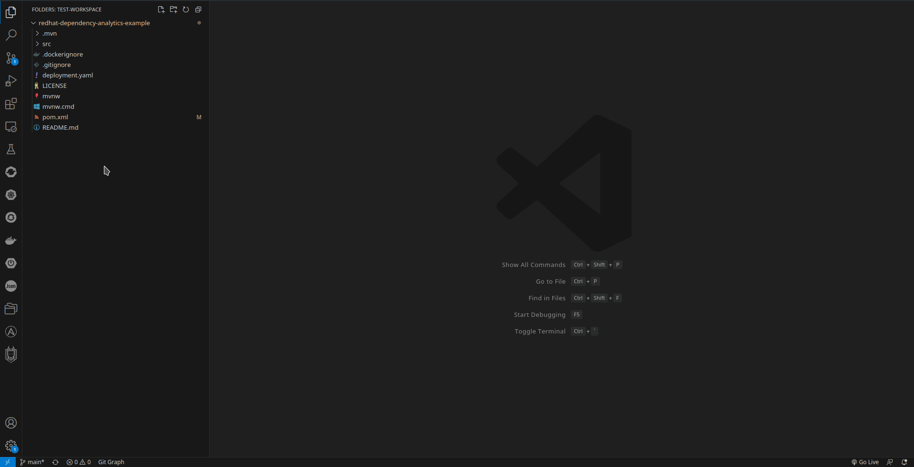

# Red Hat Dependency Analytics

[](https://marketplace.visualstudio.com/items?itemName=redhat.fabric8-analytics)

[](https://codecov.io/gh/fabric8-analytics/fabric8-analytics-vscode-extension)

Red Hat's Dependency Analytics (RHDA) extension gives you awareness to security concerns within your software supply chain while you build your application.
The Dependency Analytics extension uses the Snyk REST API to query [Snyk's Vulnerability Database](https://snyk.io/product/vulnerability-database/) for the most up-to-date vulnerability information available.
Snyk uses industry-leading security intelligence by pulling from many data sources to give you exact vulnerability information.

**NOTE:**
<br >The Red Hat Dependency Analytics extension is an online service hosted and maintained by Red Hat.
Dependency Analytics only accesses your manifest files to analyze your application dependencies before displaying the vulnerability report.

**IMPORTANT:**
<br >Currently, Dependency Analytics only supports projects that use Maven (`mvn`), Node (`npm`), Golang (`go mod`) and Python (`pip`) ecosystems.
In future releases, Red Hat plans to support other programming languages.

##### Table of Contents
- [Quick start](#quick-start)
- [Configuration](#configuration)
- [Features](#features)
- [Using Red Hat Dependency Analytics for CI builds](#using-red-hat-dependency-analytics-for-ci-builds)
- [Know more about the Red Hat Dependency Analytics platform](#know-more-about-the-red-hat-dependency-analytics-platform)
- [Data and telemetry](#data-and-telemetry)
- [Support, feedback \& questions](#support-feedback--questions)
- [License](#license)

## Quick start

**Prerequisites**

- For Maven projects, analyzing a `pom.xml` file, you must have the `mvn` binary in your system’s `PATH` environment.
- For Node projects, analyzing a `package.json` file, you must have the `npm` binary in your system’s `PATH` environment.
- For Golang projects, analyzing a `go.mod` file, you must have the `go` binary in your system’s `PATH` environment.
- For Python projects, analyzing a `requirements.txt` file, you must have the `python3/pip3` or `python/pip` binaries in your system’s `PATH` environment.

<br >**IMPORTANT:** 
<br >Visual Studio Code by default executes binaries directly in a terminal found in your system's `PATH` environment.
You can configure Visual Studio Code to look somewhere else to run the necessary binaries.
You can configure this by accessing the [extension settings](https://code.visualstudio.com/docs/getstarted/settings).
Click the **Workspace** tab, search for the word _executable_, and specify the absolute path to the binary file you want to use for Maven, Node or Golang.

**Procedure**

1. Install [Visual Studio Code](https://code.visualstudio.com/) on your workstation.
2. After the installation finishes, open the Visual Studio Code application.
3. From the file menu, click **View**, and click **Extensions**.
4. Search the **Marketplace** for _Red Hat Dependency Analytics_.
5. Click the **Install** button to install the extension.
6. To start scanning your application for security vulnerabilities, and view the vulnerability report, you can do one of the following:
   - Open a manifest file, hover over a dependency marked by the inline Component Analysis, indicated by the wavy-red line under a version number or dependency name, click **Quick Fix**, and click **Detailed Vulnerability Report**.
   - Open a manifest file, and click the **pie chart** icon .
   - Right click on a manifest file in the **Explorer** view, and click **Red Hat Dependency Analytics Report...**.
   - From the vulnerability pop-up alert message, click **Open detailed vulnerability report**.
7. (OPTIONAL) You can link your Snyk account to Dependency Analytics by doing the following:
   1. Log into your [Snyk account](https://app.snyk.io/login?utm_campaign=Code-Ready-Analytics-2020&utm_source=code_ready&code_ready=FF1B53D9-57BE-4613-96D7-1D06066C38C9).
   2. On the account landing page, you can find your Snyk Token, copy the token.
   3. Open the Red Hat Dependency Analytics extension settings.
   4. Click the **Workspace** tab.
   5. Paste the Snyk token in the **Exhort Snyk Token** field.
   6. After adding your Snyk token, the vulnerability report gives you detailed information about security vulnerabilities unique to Snyk, and vulnerabilities that have publicly known exploits.

## Configuration

The Red Hat Dependency Analytics extension has some configurable parameters that allows you to customize its behavior according to your preferences.

**Procedure**

1. Open the Visual Studio Code application.
2. From the file menu, click **View**, and click **Extensions**.
3. Find the installed **Red Hat Dependency Analytics** extension, and click on the **Gear** icon.
4. Click **Extension Settings**.

   

### Configurable parameters

**Exhort Snyk Token** :
<br >The Snyk token allows Exhort to authenticate with the Snyk Vulnerability Database.
If a Snyk token is not provided, Snyk vulnerability information is not displayed.

If you leave this field blank, the following informational message is displayed.
<br >

If you enter a invalid Snyk token, a pop-up message alerts you that your Snyk token is not valid.
<br >

If you need a new Snyk token, you can generate a new token [here](https://app.snyk.io/login?utm_campaign=Code-Ready-Analytics-2020&utm_source=code_ready&code_ready=FF1B53D9-57BE-4613-96D7-1D06066C38C9).

**Red Hat Dependency Analytics Report File Path** :

Specify the local path to create the Dependency Analytics report file.
The default path is `/tmp/redhatDependencyAnalyticsReport.html`.

## Features

- **Component analysis**
	<br >Upon opening a manifest file, such as a `pom.xml`, `package.json`, `go.mod` or `requirements.txt` file, a scan starts the analysis process.
	The scan provides immediate inline feedback on detected security vulnerabilities for your application's dependencies.
	Such dependencies are appropriately underlined in red, and hovering over it gives you a short summary of the security concern.
	The summary has the full package name, version number, the amount of known security vulnerabilities, and the highest severity status of said vulnerabilities.
	
	**NOTE:** Add the `target` folder to your `.gitignore` file to exclude it from Git monitoring.

	

- **Excluding dependencies with `exhortignore`**
	<br >You can exclude a package from analysis by marking the package for exclusion.
	If you wish to ignore vulnerabilities for a dependency in a `pom.xml` file, you must add `exhortignore` as a comment against the dependency, group id, artifact id, or version scopes of that particular dependency in the manifest file.
	For example:

	```xml
	<dependency> <!--exhortignore-->
		<groupId>...</groupId>
		<artifactId>...</artifactId>
		<version>...</version>
	</dependency>
	```

	If you wish to ignore vulnerabilities for a dependency in a `package.json` file, you must add `exhortignore` as a attribute-value pair.
	If `exhortignore` is followed by a list of comma-separated Snyk vulnerability IDs, only the listed vulnerabilities will be ignored during analysis.
	For example:

	```json
	{
		"name": "sample",
		"version": "1.0.0",
		"description": "",
		"main": "index.js",
		"keywords": [],
		"author": "",
		"license": "ISC",
		"dependencies": {
			"dotenv": "^8.2.0",
			"express": "^4.17.1",
			"jsonwebtoken": "^8.5.1",
			"mongoose": "^5.9.18"
		},
		"exhortignore": [
			"jsonwebtoken"
		]
	}
	```

	If you wish to ignore vulnerabilities for a dependency in a `go.mod` file, you must add `exhortignore` as a comment against the dependency in the manifest file.
	For example:
	```
	require (
		golang.org/x/sys v1.6.7 // exhortignore
	)
	```

	If you wish to ignore vulnerabilities for a dependency in a `requirements.txt` file, you must add `exhortignore` as a comment against the dependency in the manifest file.
	For example:
	```
	requests==2.28.1 # exhortignore
	```

- **Excluding developmental or test dependencies**
	<br >Red Hat Dependency Analytics does not analyze dependencies marked as `dev` or `test`, these dependencies are ignored.
	
	For example, setting `test` in the `scope` tag within a `pom.xml` file:

	```xml
	<dependency>
		<groupId>...</groupId>
		<artifactId>...</artifactId>
		<version>...</version>
		<scope>test</scope>
	</dependency>
	```	

	For example, setting `devDependencies` attributte in the `package.json` file:
	
	```json
	{
		"name": "sample",
		"version": "1.0.0",
		"description": "",
		"main": "index.js",
		"keywords": [],
		"author": "",
		"license": "ISC",
		"dependencies": {
			"dotenv": "^8.2.0",
			"express": "^4.17.1",
			"jsonwebtoken": "^8.5.1",
			"mongoose": "^5.9.18"
		},
		"devDependencies": {
			"axios": "^0.19.0"
		}
	}
	```

	For example, setting `exclude` attributte in the `go.mod` file:

	```
	exclude golang.org/x/sys v1.6.7

	exclude (
		golang.org/x/sys v1.6.7
	)
	```

	For example, creating an alternative file to `requirements.txt`, like `requirements-dev.txt` or `requirements-test.txt` and adding the dev or test dependencies there istead.

- **Red Hat Dependency Analytics report** 
	<br >The Red Hat Dependency Analytics report is a temporary HTML file that exist if the **Red Hat Dependency Analytics Report** tab remains open.
	Closing the tab removes the temporary HTML file.
	You can specify the file name by [modifying the _Red Hat Dependency Analytics: Red Hat Dependency Analytics Report File Path_ field](#configuration) in the extension settings.

## Using Red Hat Dependency Analytics for CI builds

You can automate the analysis of your application's vulnerabilities within the build and release pipeline.
Red Hat offers integration with these Continuous Integration (CI) platforms:

- [Red Hat Dependency Analytics Tekton Task](https://hub.tekton.dev/tekton/task/redhat-dependency-analytics)
- [Red Hat Dependency Analytics Jenkins Plugin](https://plugins.jenkins.io/redhat-dependency-analytics/)

## Know more about the Red Hat Dependency Analytics platform

The goal of this project is to significantly enhance a developer's experience by providing helpful vulnerability insights for their applications.

- [GitHub Organization](https://github.com/fabric8-analytics)

## Data and telemetry

The Red Hat Dependency Analytics Extension for Visual Studio Code collects anonymous [usage data](Telemetry.md) and sends it to Red Hat servers to help improve our products and services.
Read our [privacy statement](https://developers.redhat.com/article/tool-data-collection) to learn more.
This extension respects the `redhat.telemetry.enabled` setting, which you can learn more about [here](https://github.com/redhat-developer/vscode-commons#how-to-disable-telemetry-reporting).

## Support, feedback & questions

There are two ways you can contact us:
- You can reach out to us at `rhda-support@redhat.com` with any questions, feedback, and general support.
- You can also file a [GitHub Issue](https://github.com/fabric8-analytics/fabric8-analytics-vscode-extension/issues).

## License

Apache 2.0, See [LICENSE](LICENSE) for more information.
